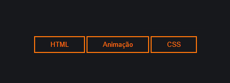
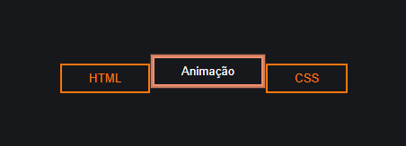

# Botões Animados e Alaranjados

## Sobre o projeto.
Botões desenvolvidos utilizando Keyframe Animation do CSS. Botões que mudam a cor ao encostar o mouse ou passar com o tab por cima.  <br><br>
Data de conclusão: 19/10/2021<br><br>
## Ferramentas e tecnologias usadas nesse projeto.
```js    
function Button(Project) {
    const FrontEnd = `${HTML}, ${CSS}`;
};

``` 
<br>

<div align="center">




</div>

---

> - Autores: 
>   - [Eduardo Kayke](https://github.com/EduardoKayke "Perfil do Eduardo")

- [Voltar ao perfil do Github.](https://github.com/EduardoKayke "Perfil do Eduardo") 

_Um dia seremos a tecnologia. Biohacking a própria evolução de nós mesmos._
